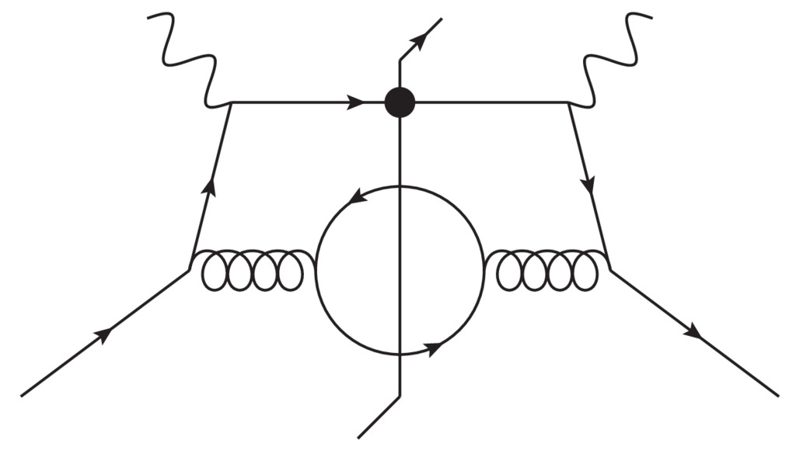
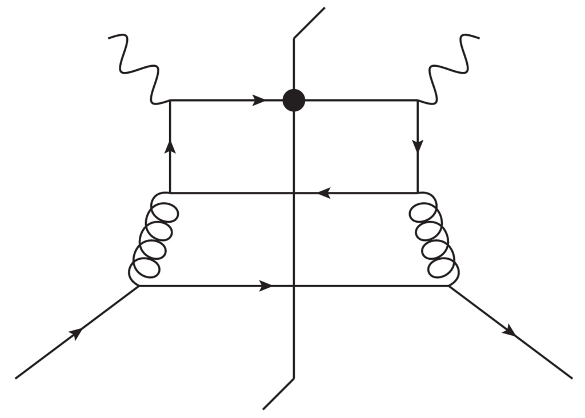
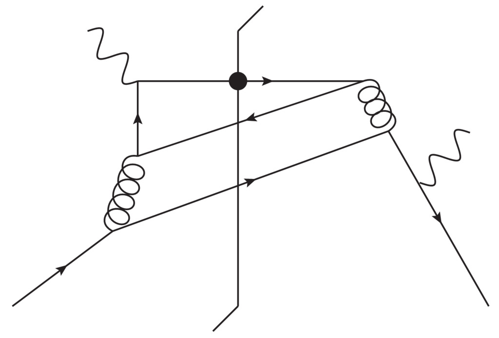

Tutorial
========

This documentation explains how to generate the SIDIS cross section:

.. math::

  \frac{d\sigma}{dx dQ^2 dz dp_{\rm T}}

in units of :math:`{\rm GeV}^{-5}`. Here, :math:`p_{\rm T}` is the produced
hadron's transverse momentum in the Breit frame and :math:`x,z,Q^2` are the
usual kinematical variables. 

Getting started
---------------

- Install Anaconda with python2 in your system which you can get for free at
  https://www.anaconda.com

- Install lhapdf in your system. 

- Open up a terminal. Below ``$`` denotes the terminal prompt.

- You will need to make lhapdf reachable from python. For that you need 
  to set the environment variables ``PYTHONPATH`` and
  ``LD_LIBRARY_PATH``. For bash it can be done as

.. code-block:: bash

   export PATH=<path2lhapdf>/bin:$PATH 
   export PYTHONPATH=$PYTHONPATH:path2lhapdf/lib/python2.7/site-packages/
   export LD_LIBRARY_PATH=<lhapdf>/lib 

-  Alternatively you can place these lines in your ``.bashrc`` file

-  Clone the repository from github

.. code-block:: bash

   git clone git@github.com:JeffersonLab/BigTMD.git

- Go inside the repo directory

.. code-block:: bash

   cd BigTMD

- Copy the folders ``lhapdf/dsshpNLO`` and  ``lhapdf/dsshmNLO`` inside to 

.. code-block:: bash
  
    <path2lhapdf>/share/LHAPDF/

- This will allow you to load DSS07 fragmentation functions from lhapdf 

- Run the setup script (this takes some time)

.. code-block:: bash

   ./setup.py  

- The script ``sidis.py`` orchestrates the full NLO calculation 
  for a given kinematic point :math:`x,Q^2,z,q_{\rm T}=p_{\rm T}/z`

- Use ``driver.py`` as an example. You can run it simply like 

.. code-block:: bash

   ./driver.py  

Details
-------

In the above, ``driver.py`` calls a function ``sidis.get_xsec`` from
``sidis.py``. In turn, ``sidis.py`` imports ``LO.py`` and the contents of 
:math:`P_g` and :math:`P_{pp}` in the NLO directory.  ``LO.py`` 
contains the leading order cross section directly, while 
:math:`P_g` and :math:`P_{pp}` contain all channels
and charge configurations for the next-to-leading order cross section.
(See ``citation`` for explanations of symbols, including
:math:`P_g` and :math:`P_{pp}`.) These functions are of the form 

.. math::
 {\text{ fchn(channel)(charge configuration)}} .

The following table  summarizes the various incoming and outgoing
parton combinations for the virtual and real contributions.  

.. list-table:: channels index
   :widths: 5 5 5
   :header-rows: 1

   * - channel 
     - virtual
     - real
   * - 1 
     - :math:`\gamma^*+g  \to(q\to h)+\bar{q}`
     - :math:`\gamma^*+g  \to(q\to h)+\bar{q}+g`
   * - 2
     - :math:`\gamma^*+q \to(q\to h)+g`
     - :math:`\gamma^*+q \to(q\to h)+g+g`
   * - 
     - 
     - :math:`\gamma^*+q \to(q \to h)+q'+\bar{q}'`
   * - 3 
     - :math:`\gamma^*+q \to(g\to h)+q`
     - :math:`\gamma^*+q \to(g \to h)+q+g`
   * - 4         
     -                             
     - :math:`\gamma^*+g \to(g \to h) +q +\bar{q}`
   * - 5                     
     - 
     - :math:`\gamma^*+q \to(\bar{q}\to h)+ q + \bar{q}`
   * - 6                        
     - 
     - :math:`\gamma^*+q\to(q' \to h)+q+\bar{q}`

The ``channels`` are organized  such that IR singularities of the virtual
contribution matches with those from the real contributions. :math:`\gamma^*` is the
virtual photon, :math:`g` is a gluon, :math:`q` and :math:`q` denote different
quark flavors, and :math:`\bar{q}` and :math:`\bar{q}'` are the antiparticles
of :math:`q` and :math:`q'` respectively.  :math:`f \to h` means it is the
parton of flavor "math:`f` that hadronizes.  For example,

.. math::
  \gamma^*+q \to(g \to h)+q+g

refers to graphs with 3 unobserved real
emissions where a target quark leads to a hadronizing final state
gluon and an unobserved quark and gluon. The correspondence between
real and virtual graphs is in the sense of Table I of ``citation``.

By ``charge configuration`` we mean whether the photon couples
directly to the charge of a target (anti)quark. ``A charge configuration``
:math:`A` is when the photon couples directly to the quark flavor in the
pdf,

configuration :math:`C` is when it does not, 

and :math:`B` is an interference
between two such cases. See Fig.``chgcon`` for examples.

